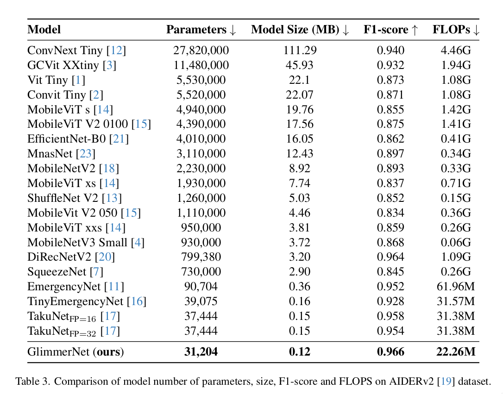

# GlimmerNet: A Lightweight Grouped Dilated Depthwise Convolutions for UAV-Based Emergency Monitoring

This codebase represents implementation of the **GlimmerNet** paper. The [TakuNet](https://github.com/DanielRossi1/TakuNet) implementation is used as a framework for training and evaluation purposes. Our main changes are related to the building blocks of the Neural Network, located in the `src/networks`. The **GlimmerNet** achieved the best F1-score with the lowest number of parameters among concurents, as shown in the results table:


## Create docker image
For all functionalities running we use docker environment.
The dedicated docker image can be build with follownig commands:
```bash
cd docker
./build.sh
```

The generated docker image will have the name **glimmernet-docker**. This can be changed directly in the `docker/build.sh` bash script.

## Run docker container
The docker container can be run with:
```bash
docker run --rm --gpus device=0 -ti -v {USER_DIR_PATH}/gdd-cnn/src:/home/user/src --name gddnet glimmernet-docker:latest bash
```

Here is just as an example used one GPU as resource.

## Dataset
The datasets AIDER and AIDERv2 can be downloaded and unpacked using the bash script:
```bash
cd src
./get_datasets.sh
```

## Run training and evaluation
All relevant parameters for model training are placed in `src/configs/GlimmerNet_AIDERV2.yaml` file. Once it is configured, for training it is important to set `mode: train`. The command for running experiment is:
```bash
./launch.sh GlimmerNet_AIDERV2
```
The parameter of this bash script must be the name of config file without *.yml* extension.

For evaluation of trained model on the test dataset it is important to set
`mode: test`. The parameter `ckpts_path` should be set to some of the saved checkpoints. Specifically, we used one with the best F1-score (for example `src/runs/AIDERV2/GlimmerNet_AIDERV2/version_{NUM}/checkpoints/best_model_val_f1.ckpt`).